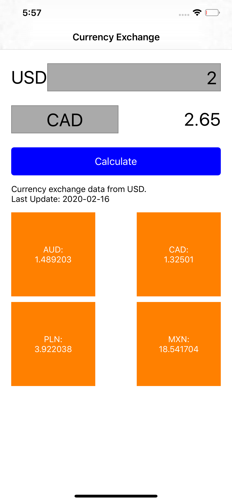

# CurrencyCalc
This repo is the answer of PayPay coding challenge.

### Special Notes:
- Please run `$ pod install` after cloning this repo from GitHub or downloading it from email. It should ensure the podfiles are installed correctly for the project.
- Please user `develop` branch to run the projects in Simulator/Real Device.

### Functional Requirements:
- [x] Exchange rates must be fetched from: https://currencylayer.com/documentation  
- [x] Use free API Access Key for using the API
- [x] User must be able to select a currency from a list of currencies provided by the API(for currencies that are not available, convert them on the app side. When converting, floating-point error is accpetable)
- [x] User must be able to enter desired amount for selected currency
- [x] User should then see a list of exchange rates for the selected currency
- [x] Rates should be persisted locally and refreshed no more frequently than every 30 minutes (to limit bandwidth usage)

### UI:

